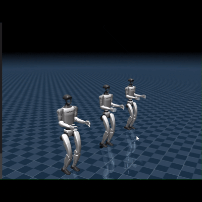

# Unitree G1 Multi-Agent Locomotion & Thriller Simulation

An open-source simulation testbed deploying batched reinforcement learning (RL) policies across multiple Unitree G1 humanoid robots in a synchronized MuJoCo environment. 

This repository provides scripts for procedural multi-agent scene synthesis, XML physics compilation, batched PyTorch policy inference, and automated dynamic camera tracking.

---

## Features

- **Multi-Agent Procedural Generation:** Automatically compiles single-robot URDF/MJCF models into a multi-agent horde while preserving critical physics parameters (damping, motor friction, contact pairs, and armature inertia).
- **Synchronized Policy Execution:** Batched PyTorch inference running parallel recurrent policy forward passes with isolated hidden memory states.
- **Autonomous Director Camera:** Smooth, real-time focal tracking locked to dynamic agent coordinates to eliminate manual viewport handling.
- **Configurable Simulation Decimation:** Adjustable simulation duration and wall-clock acceleration controls for high-speed data capture and benchmarking.

---

---

## Demo

---

## Author & Maintainer

* **Author:** [Atif Abid](https://github.com/atifabid)
* **Role:** Lead System Integration & RL Sim Development

---

## Credits & Acknowledgments

* **Robot Assets & Physical Models:** Developed by and credited to [Unitree Robotics](https://github.com/unitreerobotics) (`unitree_mujoco` / `unitree_rl_gym`).
* **Physics Engine:** Powered by [MuJoCo](https://mujoco.org/) (Multi-Joint dynamics with Contact) by Google DeepMind.
* **RL Architecture:** Policy representations and recurrent structures built on PyTorch.

---

## License & Intellectual Property Rights

This software and custom simulation pipelines are released under the [Apache 2.0 License](LICENSE).

* The custom procedural generation scripts, camera tracking modules, and batched deployment pipelines are copyrighted © 2026 [Atif Abid].
* Underlying CAD meshes, URDF descriptions, and brand assets for the G1 Humanoid are the proprietary intellectual property of Unitree Robotics and are subject to their respective upstream licensing terms.
